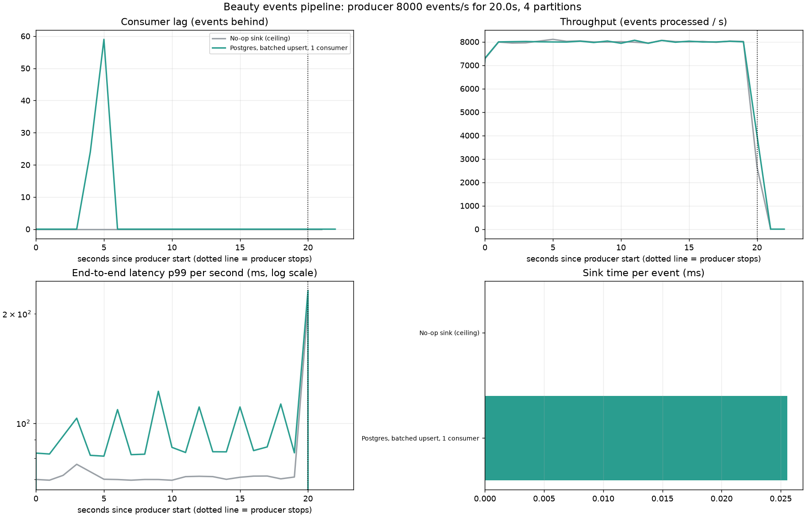

# Results

Producer rate: **8000 events/s** for **20.0 s**, 4 partitions, 5000 products with Zipf-skewed traffic.

| Scenario | Sustained throughput (events/s) | Peak lag | Drain time after producer stops | Sink ms/event | E2E p50 | E2E p99 | E2E max | Rollup mismatches |
|---|---:|---:|---:|---:|---:|---:|---:|---:|
| No-op sink (ceiling) | 7997 | 0 | 0 s | 0.000 | 0.04 s | 0.07 s | 0.21 s | n/a |
| Postgres, batched upsert, 1 consumer | 7997 | 59 | 0 s | 0.026 | 0.05 s | 0.10 s | 0.24 s | 0 |
