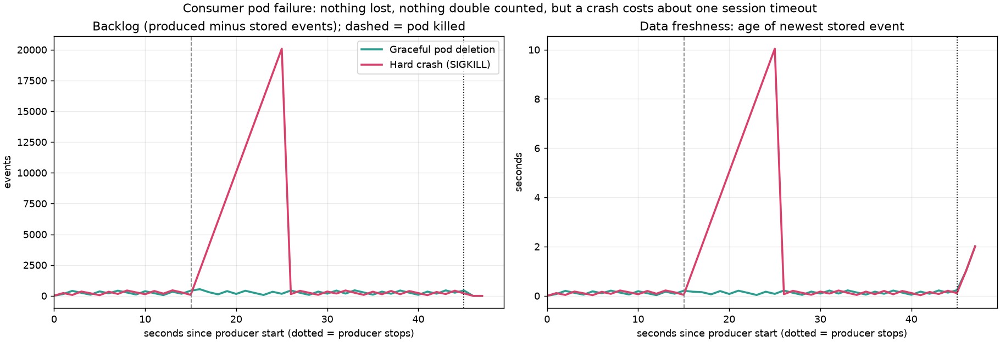
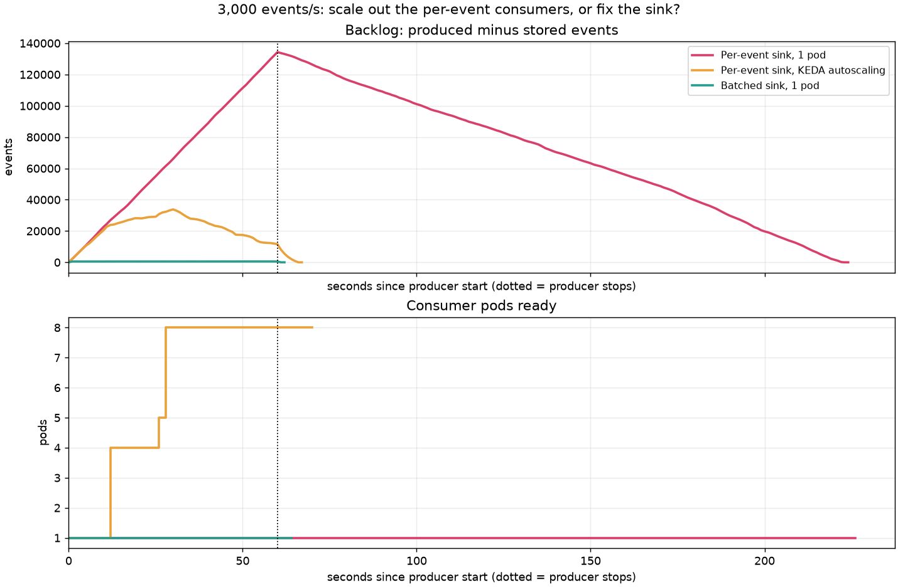
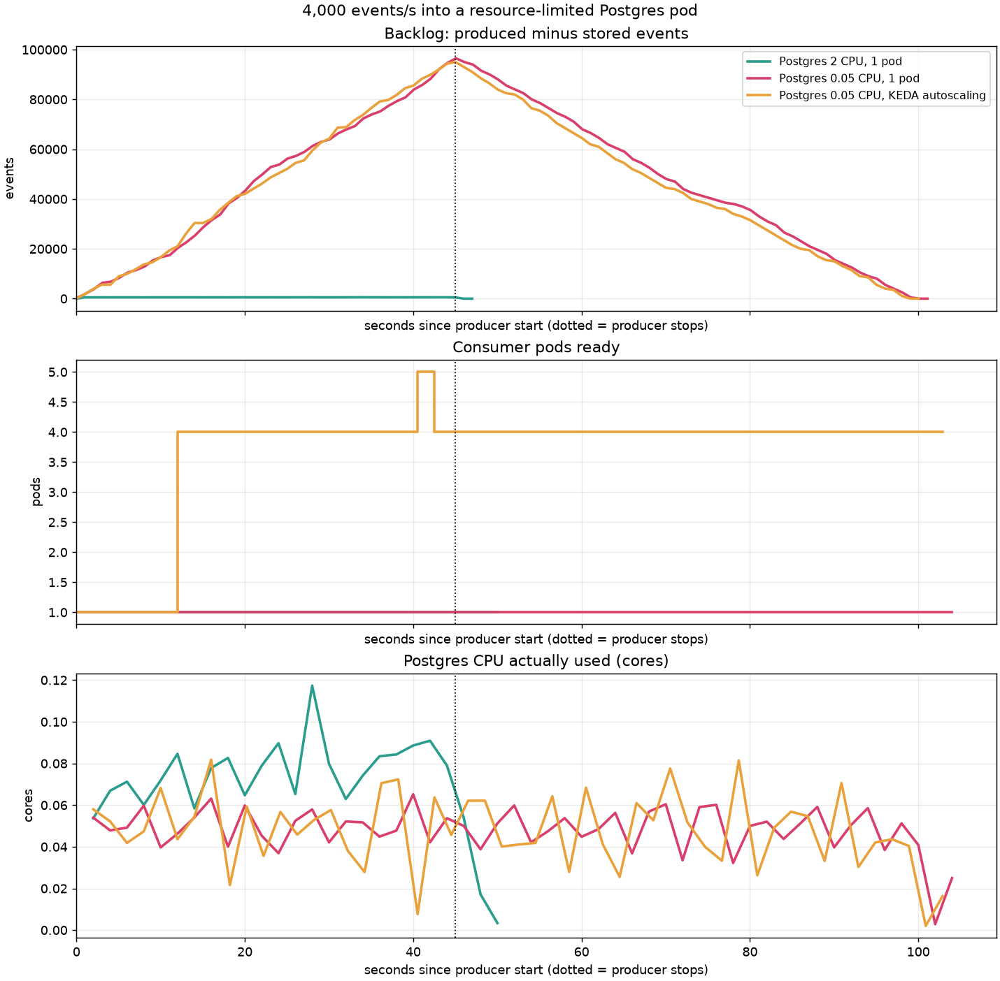
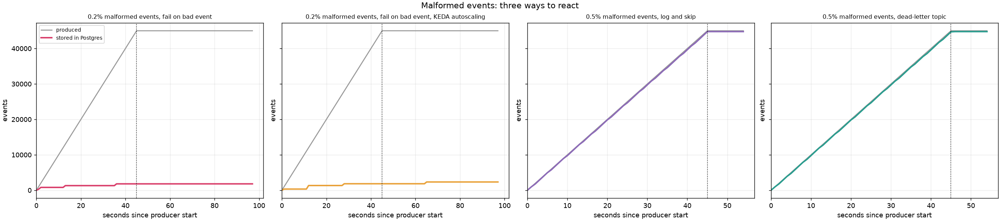

# Kubernetes results

All runs: kind (single node), Redpanda v25.2.3, Postgres 16 and consumers as pods, producer on the host at the stated rate, 8 partitions. Kubernetes-side metrics come from outside the consumers.

- **Graceful pod deletion** at t=15 s: peak backlog 541 events, max staleness 1.0 s, back under 1,000 events after 2.0 s; sent 89,994, stored 89,994, rollup mismatches 0.
- **Hard crash (SIGKILL)** at t=15 s: peak backlog 20,083 events, max staleness 10.0 s, back under 1,000 events after 11.0 s; sent 89,996, stored 89,996, rollup mismatches 0.

## Scale out consumers, or fix the sink? (3,000 events/s for 60 s)

| Scenario | Peak backlog | Max data staleness | Drain after producer stops | Max pods | Pod-seconds | Peak PG connections | Rollup mismatches |
|---|---:|---:|---:|---:|---:|---:|---:|
| Per-event sink, 1 pod | 134,322 | 163.0 s | 164 s | 1 | 226 | 1 | 0 |
| Per-event sink, KEDA autoscaling | 33,813 | 9.7 s | 7 s | 8 | 398 | 8 | 0 |
| Batched sink, 1 pod | 548 | 1.0 s | 2 s | 1 | 62 | 1 | 0 |

## Resource-limited Postgres (4,000 events/s for 45 s)

| Scenario | Peak backlog | Max data staleness | Drain after producer stops | Max pods | Pod-seconds | Peak PG connections | Rollup mismatches |
|---|---:|---:|---:|---:|---:|---:|---:|
| Postgres 2 CPU, 1 pod | 551 | 1.0 s | 2 s | 1 | 48 | 1 | 0 |
| Postgres 0.05 CPU, 1 pod | 96,498 | 55.2 s | 56 s | 1 | 102 | 1 | 0 |
| Postgres 0.05 CPU, KEDA autoscaling | 94,998 | 54.1 s | 55 s | 5 | 370 | 4 | 0 |
- Postgres 2 CPU, 1 pod: Postgres was CPU-throttled for 0 s in total.
- Postgres 0.05 CPU, 1 pod: Postgres was CPU-throttled for 60 s in total.
- Postgres 0.05 CPU, KEDA autoscaling: Postgres was CPU-throttled for 111 s in total.

## Schema change (1,000 events/s for 45 s, producer switches to v2 at t=15 s)

| Scenario | Sent | Should be stored | Stored | In dead-letter topic | Missing | Consumer restarts |
|---|---:|---:|---:|---:|---:|---:|
| v2 schema, v1-only consumer, fail on bad event | 44,995 | 44,995 | 14,930 | 0 | 30,065 | 3 |
| v2 schema, v1-only consumer, dead-letter topic, then fix and redrive | 44,998 | 44,998 | 44,998 | 30,001 (all redriven) | 0 | 0 |
| v2 schema, consumer understands v1 and v2 | 44,998 | 44,998 | 44,998 | 0 | 0 | 0 |

- v2 schema, v1-only consumer, dead-letter topic, then fix and redrive: after the consumer was fixed, redriving 30,001 dead letters and storing all events took 14 s (includes the consumer rollout).

## Malformed events (1,000 events/s for 45 s)

| Scenario | Sent | Should be stored | Stored | In dead-letter topic | Missing | Consumer restarts |
|---|---:|---:|---:|---:|---:|---:|
| 0.2% malformed events, fail on bad event | 44,995 | 44,883 | 1,800 | 0 | 43,195 | 4 |
| 0.2% malformed events, fail on bad event, KEDA autoscaling | 44,998 | 44,886 | 2,330 | 0 | 42,668 | 26 |
| 0.5% malformed events, log and skip | 44,999 | 44,762 | 44,762 | 0 | 237 | 0 |
| 0.5% malformed events, dead-letter topic | 44,998 | 44,761 | 44,761 | 237 | 0 | 0 |

- 0.5% malformed events, dead-letter topic: dead letters by reason: {'unsupported_version': 39, 'invalid_json': 44, 'unknown_event_type': 44, 'missing_field:product_id': 38, 'out_of_range:rating': 41, 'wrong_type:product_id': 31}
