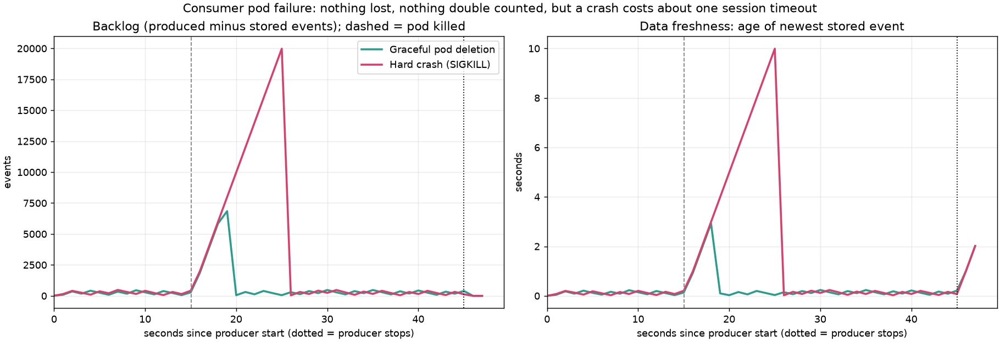
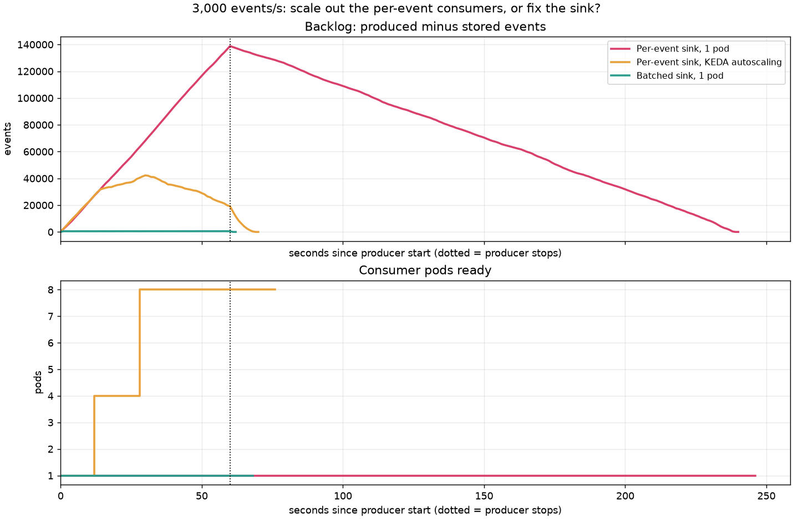
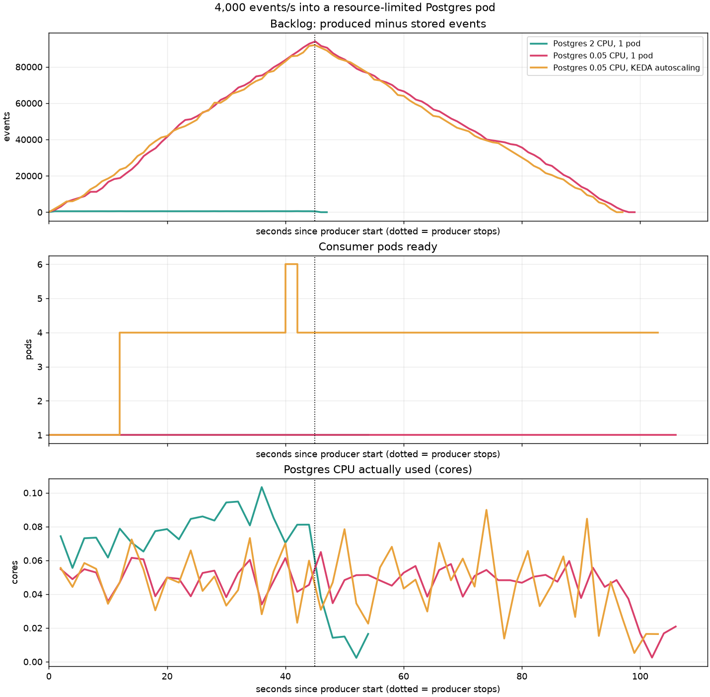
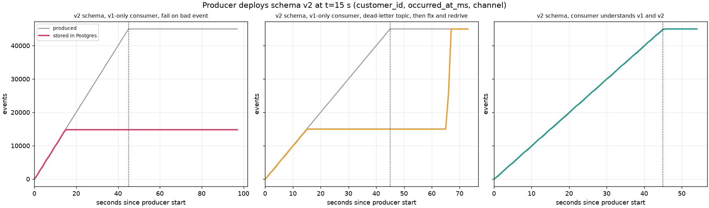

# Kubernetes results

All runs: kind (single node), Apache Kafka 4.3.1 (KRaft) on Strimzi 1.2.0, Postgres 16 and consumers as pods, producer on the host at the stated rate, 8 partitions. Kubernetes-side metrics come from outside the consumers.

- **Graceful pod deletion** at t=15 s: peak backlog 6,845 events, max staleness 2.9 s, back under 1,000 events after 5.0 s; sent 89,990, stored 89,990, rollup mismatches 0.
- **Hard crash (SIGKILL)** at t=15 s: peak backlog 19,978 events, max staleness 10.0 s, back under 1,000 events after 11.0 s; sent 89,995, stored 89,995, rollup mismatches 0.

## Scale out consumers, or fix the sink? (3,000 events/s for 60 s)

| Scenario | Peak backlog | Max data staleness | Drain after producer stops | Max pods | Pod-seconds | Peak PG connections | Rollup mismatches |
|---|---:|---:|---:|---:|---:|---:|---:|
| Per-event sink, 1 pod | 138,840 | 179.0 s | 180 s | 1 | 242 | 1 | 0 |
| Per-event sink, KEDA autoscaling | 42,261 | 13.0 s | 10 s | 8 | 428 | 8 | 0 |
| Batched sink, 1 pod | 556 | 1.0 s | 2 s | 1 | 64 | 1 | 0 |

## Resource-limited Postgres (4,000 events/s for 45 s)

| Scenario | Peak backlog | Max data staleness | Drain after producer stops | Max pods | Pod-seconds | Peak PG connections | Rollup mismatches |
|---|---:|---:|---:|---:|---:|---:|---:|
| Postgres 2 CPU, 1 pod | 573 | 1.0 s | 2 s | 1 | 48 | 1 | 0 |
| Postgres 0.05 CPU, 1 pod | 93,982 | 53.1 s | 54 s | 1 | 100 | 2 | 0 |
| Postgres 0.05 CPU, KEDA autoscaling | 91,998 | 51.0 s | 52 s | 6 | 364 | 4 | 0 |
- Postgres 2 CPU, 1 pod: Postgres was CPU-throttled for 0 s in total.
- Postgres 0.05 CPU, 1 pod: Postgres was CPU-throttled for 65 s in total.
- Postgres 0.05 CPU, KEDA autoscaling: Postgres was CPU-throttled for 119 s in total.

## Schema change (1,000 events/s for 45 s, producer switches to v2 at t=15 s)

| Scenario | Sent | Should be stored | Stored | In dead-letter topic | Missing | Consumer restarts |
|---|---:|---:|---:|---:|---:|---:|
| v2 schema, v1-only consumer, fail on bad event | 44,999 | 44,999 | 14,799 | 0 | 30,200 | 3 |
| v2 schema, v1-only consumer, dead-letter topic, then fix and redrive | 44,997 | 44,997 | 44,997 | 29,999 (all redriven) | 0 | 0 |
| v2 schema, consumer understands v1 and v2 | 44,999 | 44,999 | 44,999 | 0 | 0 | 0 |

- v2 schema, v1-only consumer, dead-letter topic, then fix and redrive: after the consumer was fixed, redriving 29,999 dead letters and storing all events took 17 s (includes the consumer rollout).

## Malformed events (1,000 events/s for 45 s)

| Scenario | Sent | Should be stored | Stored | In dead-letter topic | Missing | Consumer restarts |
|---|---:|---:|---:|---:|---:|---:|
| 0.2% malformed events, fail on bad event | 44,995 | 44,883 | 2,316 | 0 | 42,679 | 4 |
| 0.2% malformed events, fail on bad event, KEDA autoscaling | 44,998 | 44,886 | 3,435 | 0 | 41,563 | 24 |
| 0.5% malformed events, log and skip | 44,997 | 44,760 | 44,760 | 0 | 237 | 0 |
| 0.5% malformed events, dead-letter topic | 44,998 | 44,761 | 44,761 | 237 | 0 | 0 |

- 0.5% malformed events, dead-letter topic: dead letters by reason: {'invalid_json': 44, 'unsupported_version': 39, 'unknown_event_type': 44, 'missing_field:product_id': 38, 'out_of_range:rating': 41, 'wrong_type:product_id': 31}
